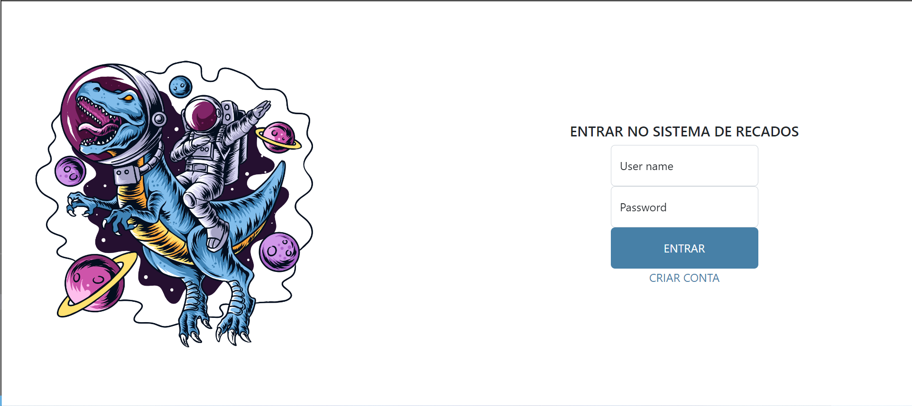
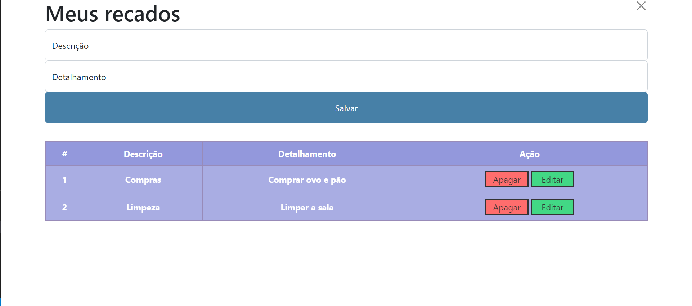
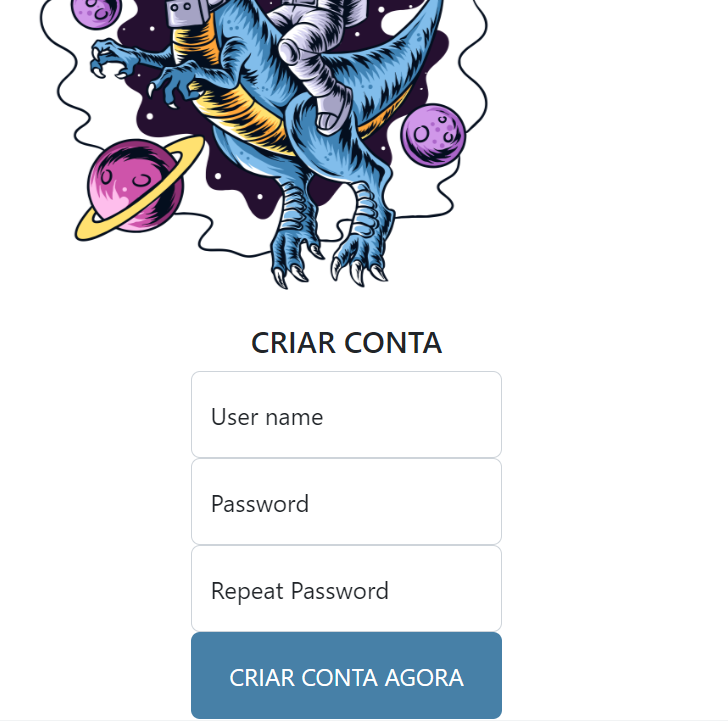
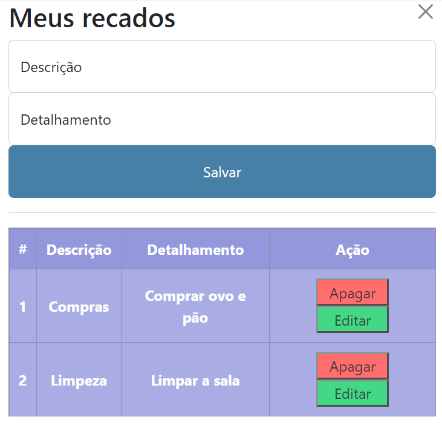

# Lista De Recados

# Sobre o projeto
Lista de recados é um projeto de final de módulo Front-End, construida durante a 7° edição do curso Full Stack Web pela Growdev.

O projeto consiste em 3 páginas, login, criar conta e lista de recados. Com foco em responsividade, typescript e Bootstrap, a aplicação tem a função de anotar os recados assim como editar e apagar caso deseje.

## Layout web

## Layout mobile

# Tecnologias utilizadas
## Front end
- HTML / CSS / JS / TypeScript
- Bootstrap

## Implementação em produção
-ReactJS

# Autor

Rafael Corrêa Nunes

https://www.linkedin.com/in/rafael-correa98/
